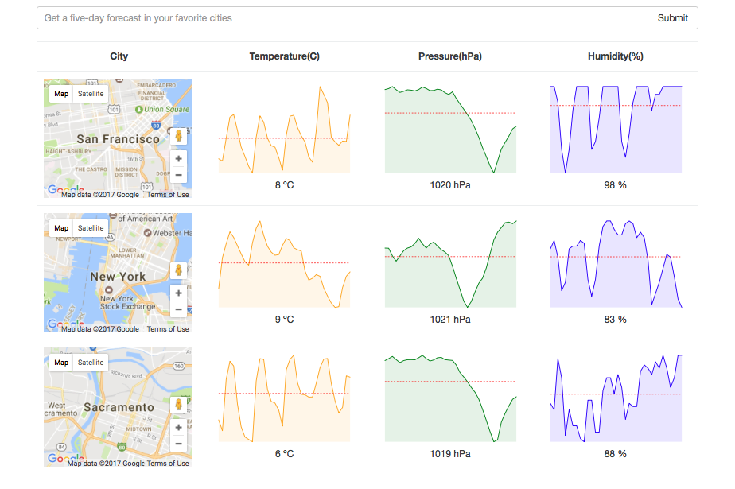

# Weather-Forecast
Weather Forecast built with React and Redux



###Getting Started###
Checkout this repo, install dependencies, then start the gulp process with the following:

```
	> git clone https://github.com/rogerio-toledo/Weather-Forecast.git
	> cd Weather-Forecast
	> npm install
	> npm start
```
